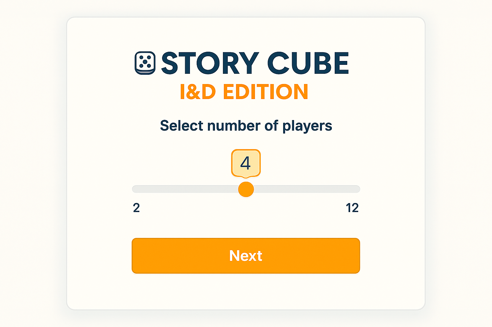
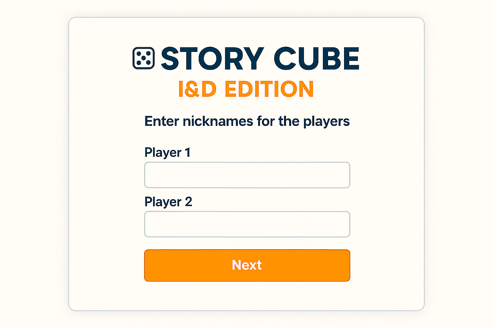
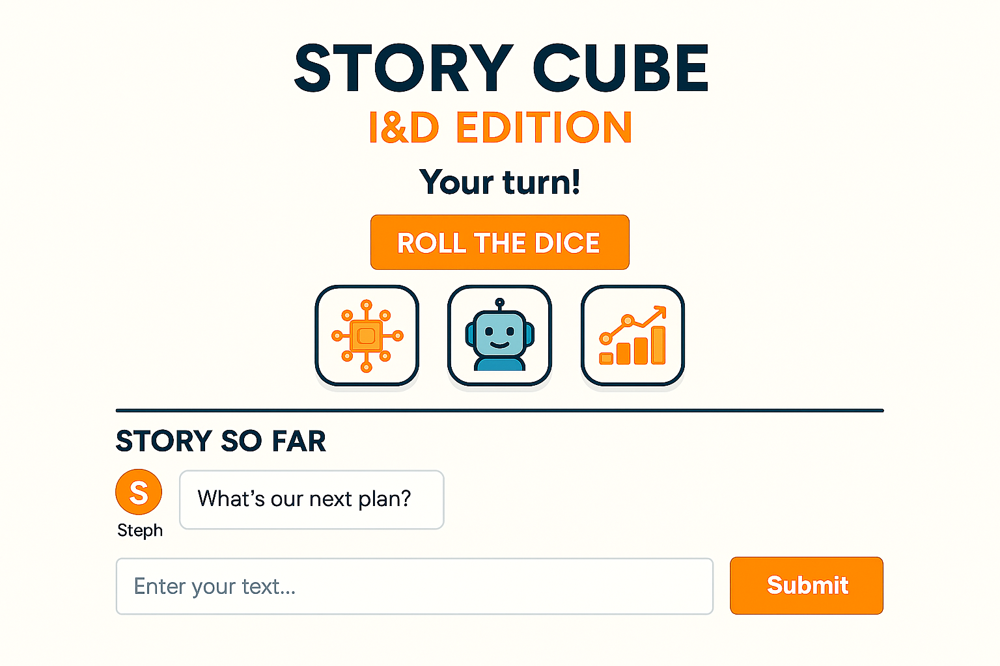
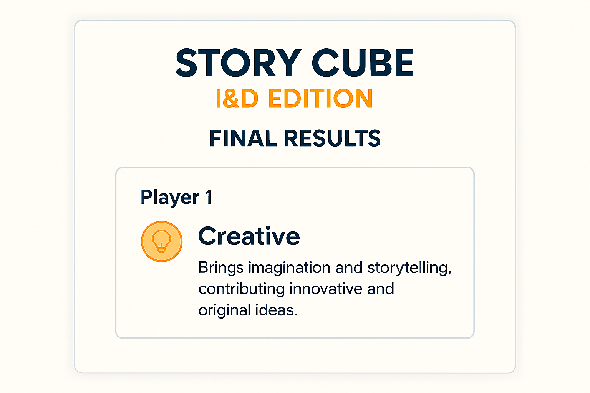

# Story Cube - I&D Edition

An interactive collaborative storytelling game designed to promote Inclusion and Diversity through gamification, shared narrative building, and self-awareness.

## Why It Matters

This project transforms inclusion from theory into practice by:

- Encouraging diverse thinking styles
- Valuing different types of contributions
- Promoting team awareness and reflective collaboration

## Key Features

- Dice-based storytelling with tech and inclusion prompts
- Multi-dimensional contribution scoring
- Archetype-based player profiling
- Collaborative turn-based narrative flow
- Local mode and Supabase shared-room multiplayer mode
- End-of-session export (JSON and XLSX)

## How It Works

1. Select number of players.
2. Enter player nicknames.
3. Roll three dice and get prompts.
4. Contribute to the shared story.
5. Get final archetype profiles and export outcomes.

## Screens

- Setup: 
- Nicknames: 
- Game: 
- Results: 

## Tech Stack

- Python 3.14
- Streamlit
- Pandas
- OpenPyXL
- Supabase Python client

## Architecture

- `app.py`: Streamlit UI and game orchestration
- `src/story_cube/models.py`: domain models
- `src/story_cube/collaborative_game.py`: turn loop and state transitions
- `src/story_cube/scoring.py`: multi-dimensional scoring logic
- `src/story_cube/archetypes.py`: archetype mapping
- `src/story_cube/reviewer_agent.py`: automated review and archetype hints
- `src/story_cube/multiplayer_store.py`: Supabase room persistence
- `src/story_cube/cube_data.py`: dice packs and prompts

## Quick Start

1. Create and activate a virtual environment.
2. Install dependencies.

```bash
pip install -r requirements.txt
```

3. Run the app.

```bash
streamlit run app.py
```

## Multiplayer Setup (Supabase)

For shared-room multiplayer, configure Supabase and Streamlit secrets:

- `SUPABASE_URL`
- `SUPABASE_ANON_KEY`

Full setup guide: `docs/supabase_multiplayer_setup.md`.

## Repository Structure

- `app.py`: Streamlit entrypoint
- `src/story_cube/`: game engine and domain modules
- `data/sessions/`: exported game sessions
- `design/`: UI mockups and reference screens
- `docs/`: architecture and setup notes
- `tests/`: smoke and validation tests

## Roadmap

- Facilitator mode dashboard (team-level recap)
- Smarter scoring signals and prompt adaptation
- Additional themed dice packs
- Presentation-ready report exports
